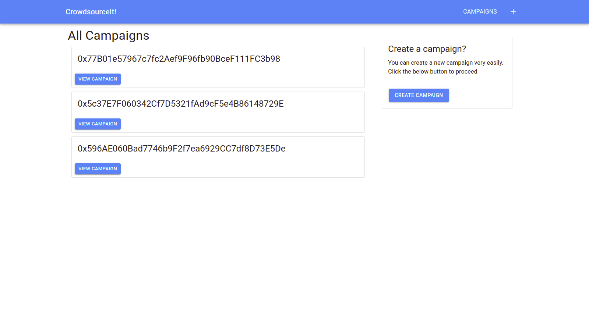
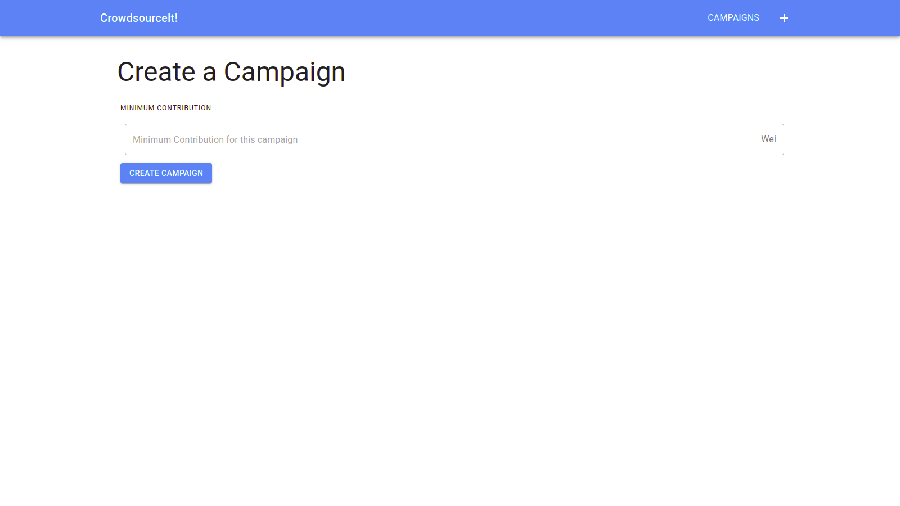
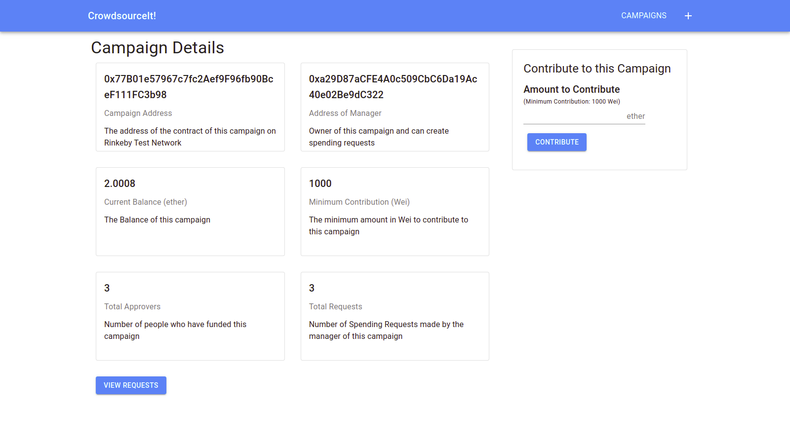
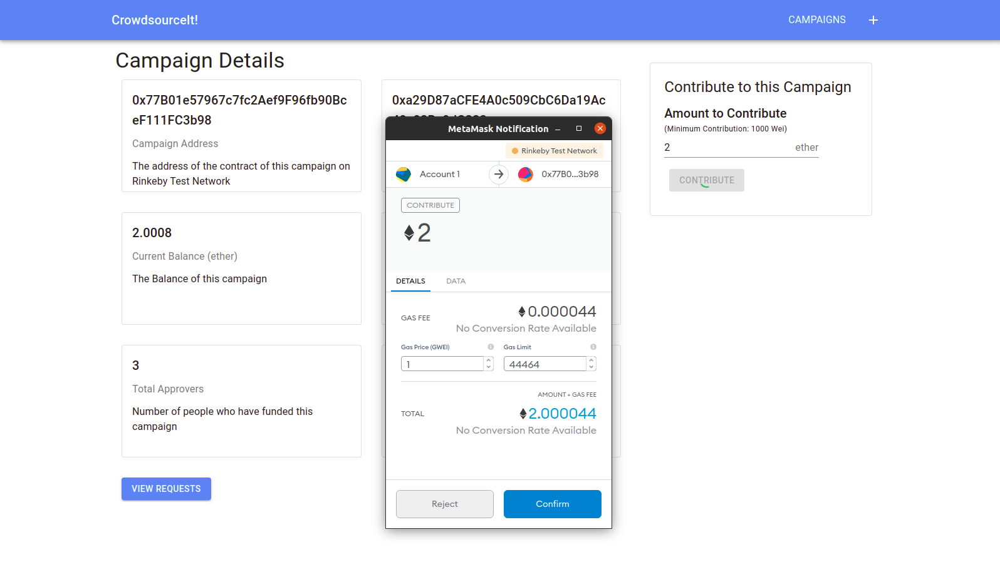
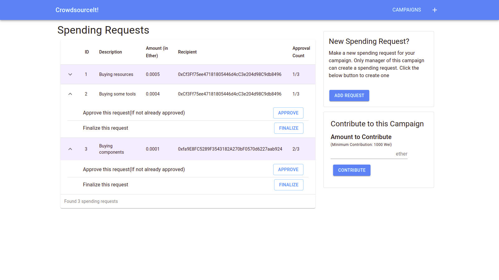
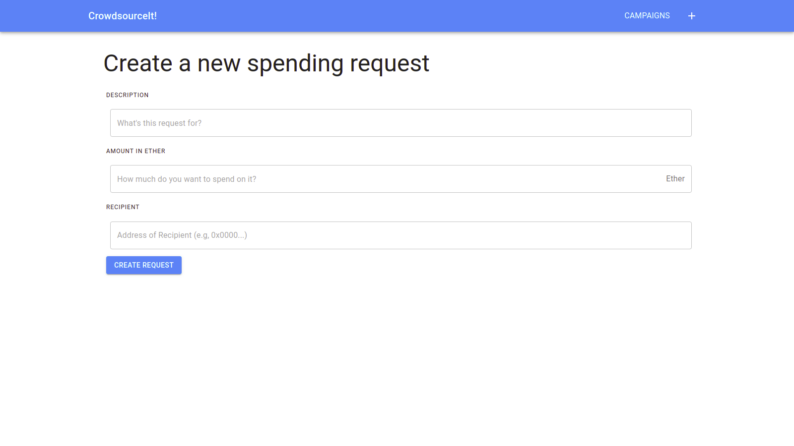

# CrowdSourceIt

**CrowdSourceIt!** is a crowdsourcing web application built using ethereum blockchain. The smart contract for this application is written entirely in [solidity](https://github.com/ethereum/solidity) (version: ^0.7.5). I have used [Next.js](https://github.com/vercel/next.js) for the web application and [Mocha](https://mochajs.org/) for testing.

## :pushpin: Features

- Decentralized application
- Eliminates fraud campaigns
- See all spending requests
- Approve spending requests
- Only campaign creator can finalize the request

## :gear: Technologies Used

- [Solidity](https://github.com/ethereum/solidity) (0.7.5)
- [Ethereum](https://www.ethereum.org/)
- [React](https://reactjs.org/) (17.0.1)
- [Next.js](https://nextjs.org/) (10.0.3)
- [Material-ui](https://material-ui.com/) (4.11.2)
- [Web3](https://github.com/ethereum/web3.js) (1.3.0)
- [Mocha](https://mochajs.org/) (8.2.1)

## :star2: Showcase

|        Home Page        |       New Campaign        |
| :---------------------: | :-----------------------: |
|  |  |

|      Campaign Details       |         Contributing          |
| :-------------------------: | :---------------------------: |
|  |  |

|      Spending Requests      |        New Request        |
| :-------------------------: | :-----------------------: |
|  |  |

## :hammer_and_wrench: Project Setup and Usage

I have used Metamask to interact with some test accounts and make transactions on Rinkeby Test Network. I have used Infura to get access to Ethereum Network.

### Initial Setup

- Install Metamask browser extension. You can visit here to install and setup Metamask in your browser - [Metamask Download Link](https://metamask.io/download.html)
- Signup and make an account in Metamask (Make sure that you are not using account which is linked to Main Network, as the project uses the security phrase) and save the generated security phrase(**MNEMONIC**). You can create more than one account with same login credentials.
- Get some Test Ethers for Rinkeby Test Network from a [Faucet](https://faucet.rinkeby.io/).
- Clone the repository and install the NPM packages

```(terminal)
cd [project_location]

npm install
```

- Signup on [Infura](https://infura.io) and make a new project in Ethereum. Get the **API KEY** from Project Settings by selecting _Rinkeby ENDPOINT_ under _Keys Section_.

### Compile the Contract

- Run following commands in root directory of project

```(terminal)
cd ethereum

node compile.js
```

### Make config.json File

- In the root directory of project, make a new JSON file named **config.json** and edit it as:

```(json)
{
  "mnemonic": "MNEMONIC",
  "infuraAPI": "API_KEY",
}
```

- Replace **MNEMONIC** by the security phrase of the Metamask account and **API_KEY** by _API Key_ received from Infura.

### Deploy the contract and edit config.json

- Run the following commands in the root directory of the project

```(terminal)
cd ethereum

node deploy.js
```

- Copy the **CONTRACT ADDRESS** from terminal window and save it to config.json in the next step.
- Edit **config.json** file to add contract address to it as:

```(terminal)
{
  "mnemonic": "MNEMONIC",
  "infuraAPI": "API_KEY",
  "ADDRESS": "CONTRACT_ADDRESS"
}
```

### Run the tests

```(terminal)
npm run test
```

### Build and run the web application

- Run the below command

```(terminal)
npm run dev
```

- Go to http://localhost:3000 and see the live demonstration.

## :page_with_curl: License

This project is built under MIT License. Check [LICENSE](LICENSE) for more details

---

<p align="center">
  Built using  <a href="https://www.ethereum.org/" title="Ethereum"></a>
  <a href="https://github.com/ethereum/solidity" title="Solidity"></a>
  <a href="https://zeit.co/next" title="Next.js"></a>
  <a href="https://material-ui.com/" title="Material UI"></a>
</p>
